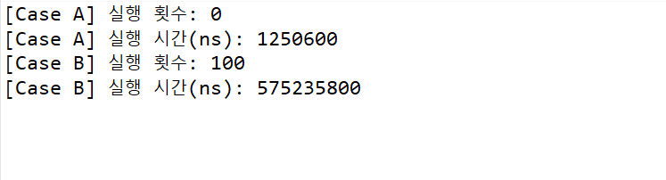

# 📘 Mistakes in Java Streams

Java Stream API를 사용하면서 자주 발생하는 **실수(Mistakes)**를 정리하고,  
각 실수가 실제로 어떤 문제를 유발하는지 **실험을 통해 검증**한 스터디 프로젝트입니다.

---

## 🎯 프로젝트 목표

- Java Stream의 동작 방식을 정확히 이해한다
- 자주 발생하는 Stream 사용 실수를 재현한다
- 실험을 통해 각 실수의 문제점을 검증한다
- 올바른 Stream 사용 방법을 코드와 결과로 정리한다

---

## 👨‍👩‍👧 팀원 소개

| | | |
|:--:|:--:|:--:|
|  |  |  |
| [**손정원**](https://github.com/handgarden) | [**이동욱**](https://github.com/cuterrabbit) | [**이승준**](https://github.com/HiLeeS) |


---

## 🧪 테스트 케이스

본 프로젝트는 **테스트 케이스 단위로 실험을 진행**하며,  
각 테스트 케이스의 상세 내용과 실행 결과는 **팀원이 개별적으로 작성**합니다.

### 테스트 케이스 목록

- **Case 1 - 터미널 연산 없는 Stream 실행 여부 검증**
  - 중간 연산만 정의된 Stream은 실제로 실행되지 않음을 코드로 검증한다.
  - [상세 문서 보기](https://github.com/woorifisa-6th-n8n-chatbot-team/mistakes-in-java-streams/blob/main/docs/case1-no-terminal.md)
  - 담당자: (HiLeeS)


- **Case 2 - 일반 For문, Sequential Stream, Parallel Stream**
  - 같은 양의 데이터를 처리하는 일반 For문과 Sequential Stream, Paraller Stream 실행 시간을 비교한다.
<<<<<<< HEAD
  
<center>
| 측정 항목 | 실행 시간 (ms) |
=======
  - 담당자: (cuterrabbit)
>>>>>>> origin/main

<center>  

| 측정 항목            | 실행 시간 (ms) |
|---------------------|---------------|
| **For-loop**            | 1493.4539     |
| **Sequential Stream**   | 1322.5975     |
| **Parallel Stream**     | 2260.0708     |

<<<<<<< HEAD
| **Parallel Stream** | 2260.0708 ms |
</center>

  - 담당자 : (cutterrabbit)
=======
</center>   

   
>>>>>>> origin/main

- **Case 3 - StreamAPI 구현 설명 및 실행 확인**
  - StreamAPI 구현 코드를 구현하고 실제 Stream의 동작과 비교한다.
  - [상세 문서 보기](https://github.com/woorifisa-6th-n8n-chatbot-team/mistakes-in-java-streams/blob/main/docs/StreamAPITest.md)
  - 담당자: (handgarden)


---

## 📂 프로젝트 구조

```text
.
├── .github/
│   ├── ISSUE_TEMPLATE/
│   └── pull_request_template.md
├── docs/
│   ├── Stream.md
│   ├── StreamAPITest.md
│   ├── StreamAPITest.png
│   ├── case1-no-terminal.md
├── src/
│   ├── LazyCase1.java
│   ├── Stream.java
│   └── StreamAPITest.java
└── .gitignore
