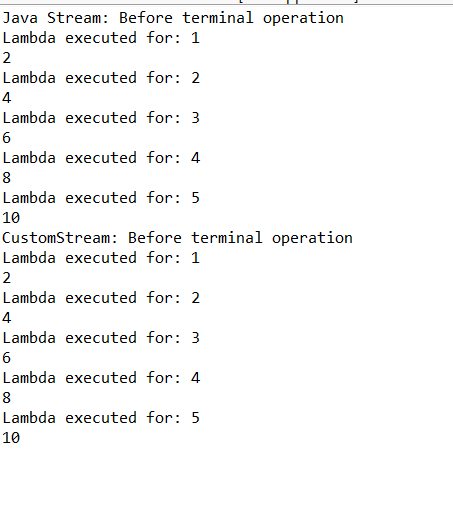

# 1. Not Using Terminal Operations:Mistake: Forgetting to call a terminal operation like collect(), forEach(), or reduce(), this leads to no execution.


## 실행 결과 및 결론

- 위 결과를 보면 stream을 사용할 때 terminal operation을 호출하지 않으면 filter와 같은 연산 함수들이 실행되지 않는 것을 알 수 있다.

## 이론 (GPT)
**terminal operation(최종 연산)** 은 Stream 이해의 *마지막 퍼즐*입니다.

---

### 한 문장 정의

> **Terminal operation은
> Stream 파이프라인을 “실제로 실행”시키고,
> 더 이상 Stream을 사용할 수 없게 만드는 연산이다.**

---

## Stream 전체 구조에서 위치

```java
source -> intermediate operations -> terminal operation
```

예:

```java
names.stream()          // source
     .filter(...)       // intermediate (lazy)
     .map(...)          // intermediate (lazy)
     .forEach(...);     // terminal (🔥 실행 트리거)
```

`forEach`가 호출되는 순간:

* 데이터 순회 시작
* `filter`, `map`이 실제로 실행됨

---

## Terminal Operation의 3가지 핵심 특징

### 🔥 1️⃣ **실행을 트리거한다**

* 그 전까지는 정의만 있음
* 호출 순간에 **source부터 한 요소씩 pull**

```java
stream.filter(...); // 실행 ❌
stream.count();     // 실행 ⭕
```

---

### 🔥 2️⃣ **Stream을 소비한다 (재사용 불가)**

```java
Stream<String> s = names.stream();
s.forEach(System.out::println);
s.count(); // ❌ IllegalStateException
```

> “stream has already been operated upon or closed”

왜?

* 내부 iterator를 소모했기 때문

---

### 🔥 3️⃣ **Stream이 아닌 결과를 반환한다**

(또는 `void`)

| 반환 타입         | 의미                 |
| ------------- | ------------------ |
| `void`        | 완전 소비 (`forEach`)  |
| `boolean`     | 조건 검사 (`anyMatch`) |
| `Optional<T>` | 일부 값               |
| `long`        | 집계                 |
| `List<T>` 등   | 컬렉션                |

👉 **Stream을 리턴하는 terminal은 없다**

---

## 대표적인 Terminal Operation 분류

### 1️⃣ 반복 / 소비

```java
forEach
forEachOrdered
```

---

### 2️⃣ 집계 (Aggregation)

```java
count
min
max
reduce
```

---

### 3️⃣ 수집 (Collect)

```java
collect(Collectors.toList())
collect(Collectors.groupingBy(...))
```

---

### 4️⃣ 탐색 / 단락(short-circuit)

```java
findFirst
findAny
anyMatch
allMatch
noneMatch
```

👉 **조건 만족 시 바로 종료**
(지연 연산의 장점)

---

## 실행 흐름 예제로 감 잡기

```java
names.stream()
     .filter(n -> {
         System.out.println("filter " + n);
         return n.startsWith("A");
     })
     .map(n -> {
         System.out.println("map " + n);
         return n.toUpperCase();
     })
     .findFirst();
```

출력:

```
filter Alice
map Alice
```

* Bob, Charlie는 아예 안 봄
* 이유: `findFirst`가 **terminal + short-circuit**

---

## 왜 terminal이 반드시 하나여야 할까?

Stream은:

* 내부 반복
* 상태 없는 파이프라인
* 한 방향 흐름

따라서:

* **실행은 단 한 번**
* **결과는 한 번만 소비**

➡ 명령형 for-loop랑 근본적으로 다름

