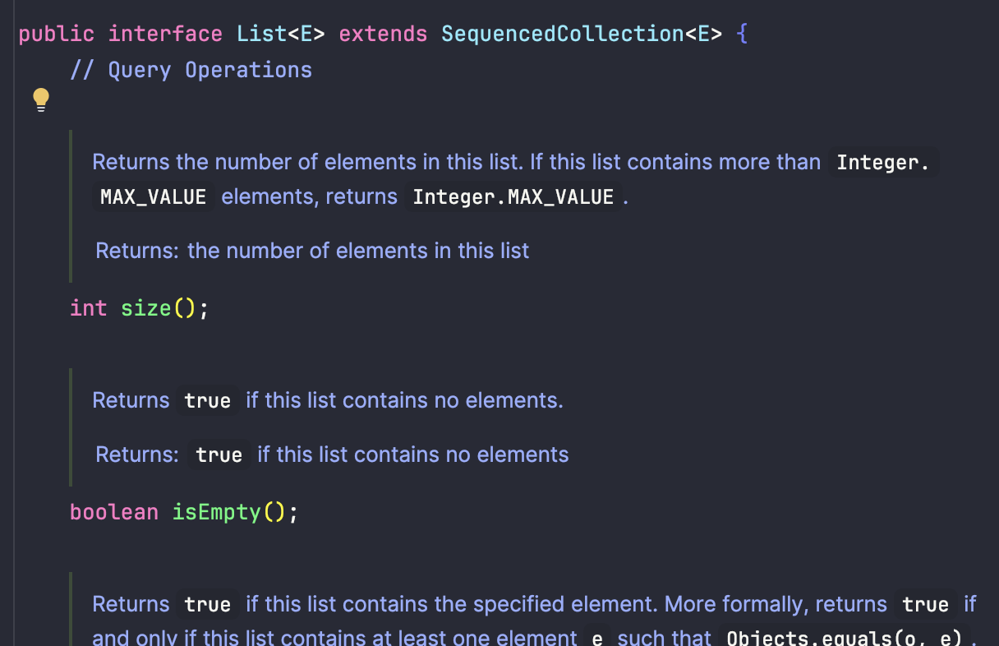
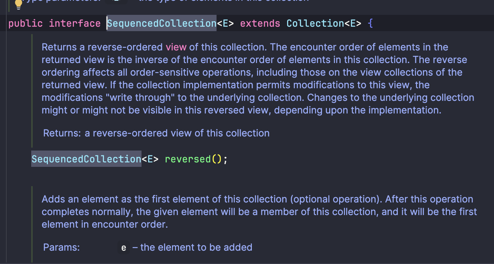
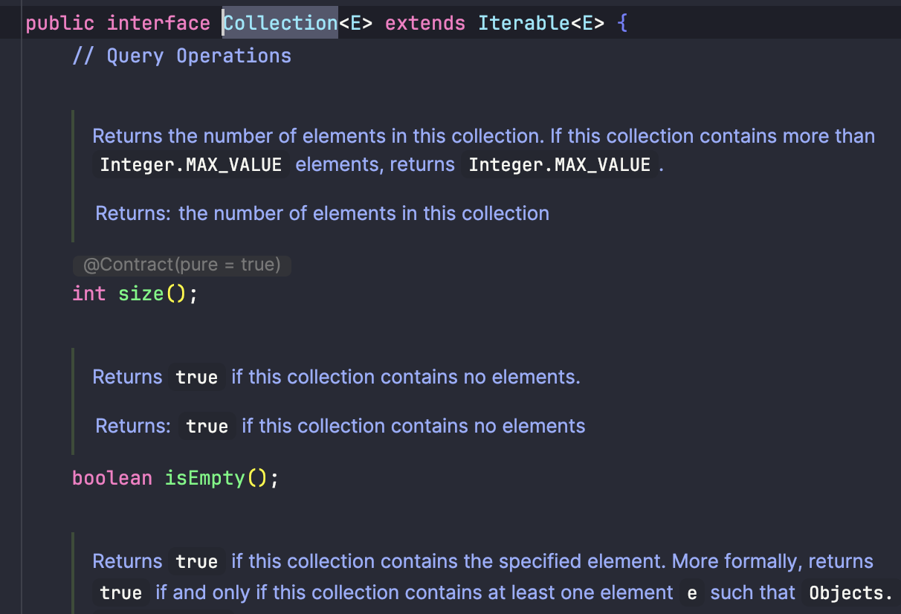
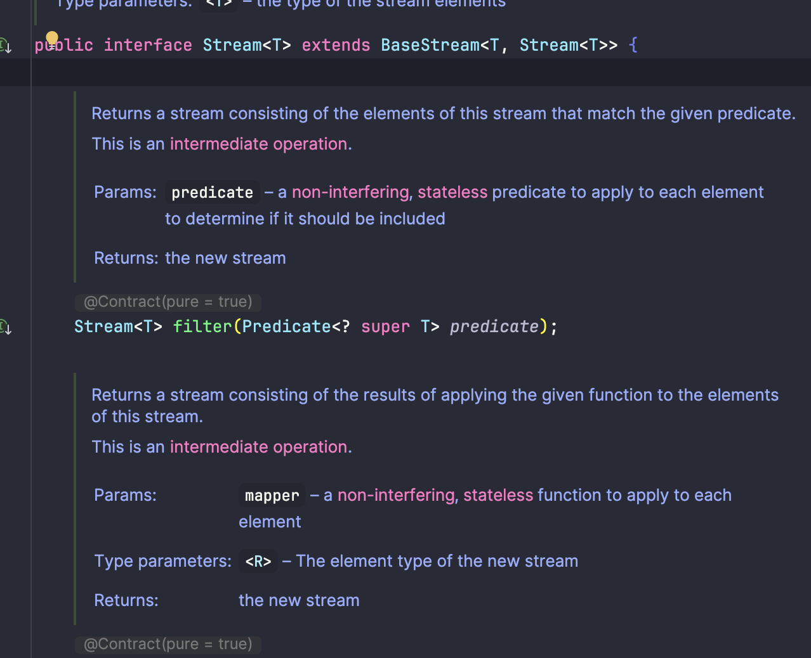
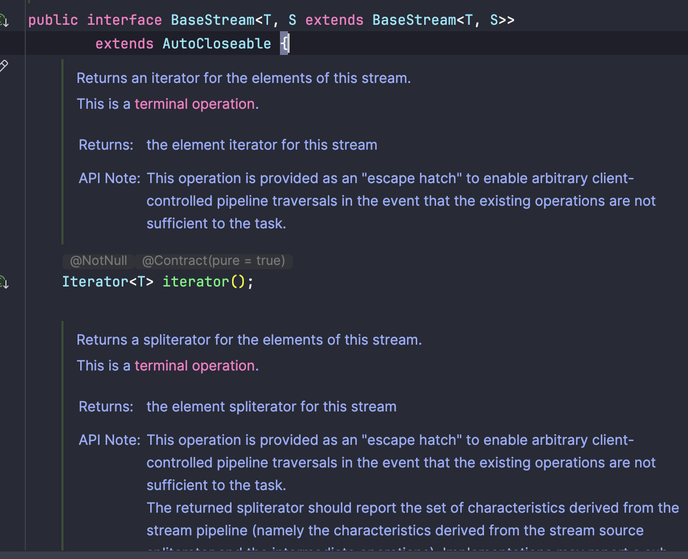

# 1. Not Using Terminal Operations:Mistake: Forgetting to call a terminal operation like collect(), forEach(), or reduce(), this leads to no execution.

## 실행 결과 및 결론


- 위 결과를 보면 stream을 사용할 때 terminal operation을 호출하지 않으면 filter와 같은 연산 함수들이 실행되지 않는 것을 알 수 있다.

## 이론

- Terminal 연산을 실행했을 때만 stream에 체이닝해서 작성한 연산들이 실행되는 이유를 분석한다.

## 반복자 패턴

- 순회하는 방법을 노출하지 않고 순회할 수 있도록 만들어주는 패턴

## List는 이터러블(반복자 패턴) 구현체

- List 구현체는 아래와 같이 SequencedCollection을 상속
  
- SequencedCollection은 Collection 상속
  
- Collection은 Iterable 구현체
  
  = List는 Iterable을 구현한 반복 가능한 객체이다.
- Stream은 BaseStream 구현체
- 
- BaseStream은 Iterator(Iterable을 가지고 있는 객체이면서 순회할 수 있음)를 필드로 가지고 있다.
- 
  = List 데이터에 .stream()을 호출하면 해당 Iterable을 가진 Iterator를 Stream 객체의 iterator 필드에 담은 후에 반환

```java

import java.util.stream.Stream;


public class Main {

    static class CustomIterator<T> {
        private final T[] data;
        private int index = 0;

        CustomIterator(T[] data) {
            this.data = data;
        }

        public boolean hasNext() {
            return index < data.length;
        }

        public T next() {
            return data[index++];
        }
    }

    @FunctionalInterface
    interface CustomTransformer<T, R> {
        R transform(T input);
    }

    static class CustomStream<T> {
        private final CustomIterator<T> iter;

        CustomStream(CustomIterator<T> iter) {
            this.iter = iter;
        }

        // 중간 연산
        public <R> CustomStream<R> map(CustomTransformer<T, R> transformer) {
            CustomIterator<R> mappedIter = new CustomIterator<>(null) {

                @Override
                public boolean hasNext() {
                    return iter.hasNext();
                }

                @Override
                public R next() {
                    T value = iter.next();
                    return transformer.transform(value);
                }
            };

            return new CustomStream<>(mappedIter);
        }

        public long count() {
            long cnt = 0;
            while (iter.hasNext()) {
                iter.next();
                cnt++;
            }
            return cnt;
        }
    }

    static class CustomList<T> {
        private final CustomIterator<T> iterator;

        private CustomList(CustomIterator<T> iterator) {
            this.iterator = iterator;
        }

        public static <T> CustomList<T> asList(T ... data) {
            CustomIterator<T> iterator = new CustomIterator<>(data);
            return new CustomList<>(iterator);
        }

        public CustomStream<T> stream() {
            return new CustomStream<>(this.iterator);
        }
    }

    public static void main(String[] args) {
        List<Integer> data = Arrays.asList(1, 2, 3, 4, 5);
        Stream<Integer> javaStream = data.stream()
                .map(num -> {
                    System.out.println("Lambda executed for: " + num);
                    return num * 2;
                });
        System.out.println("Java Stream: Before terminal operation");
        long javaCount = javaStream.count();
        System.out.println("Java Stream: Count: " + javaCount);

        CustomList<Integer> customData = CustomList.asList(1, 2, 3, 4, 5);
        CustomStream<Integer> stream = customData.stream()
                .map(num -> {
                    System.out.println("Lambda executed for: " + num);
                    return num * 2;
                });

        System.out.println("CustomStream: Before terminal operation");
        long count = stream.count();
        System.out.println("CustomStream: Count: " + count);
    }
}
```

### 결론

- terminal 연산자를 만나는 경우에만 실제 람다가 호출되면서 작성한 로직들이 동작함

### 관련 도서

https://github.com/marpple/multi-paradigm-programming
